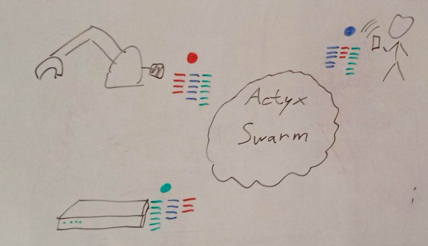
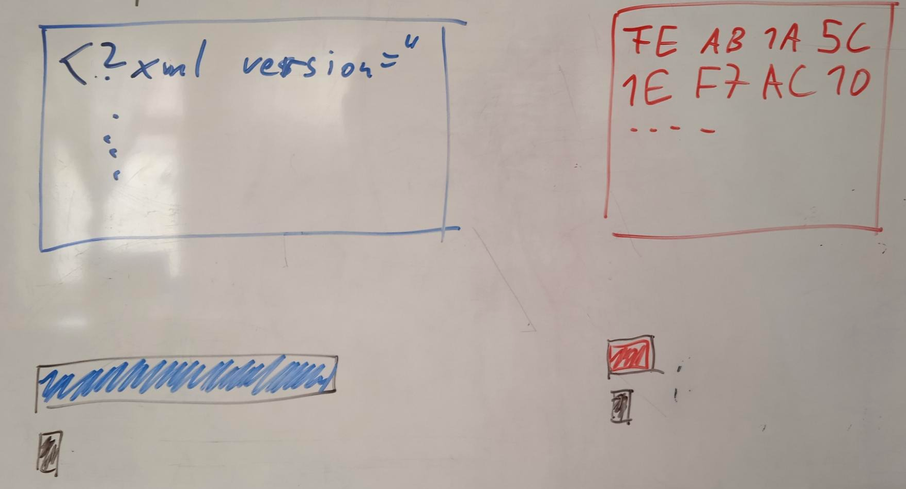
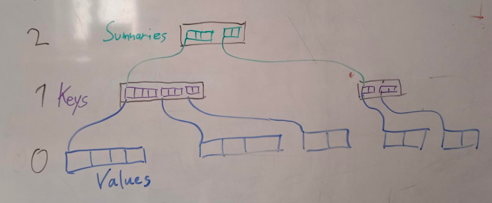

# Repo

```
git clone git@github.com:rklaehn/banyan-ipfs-camp-2022.git
cargo run
```

#  Actyx



# Needs at Actyx

- event storage for distributed event sourcing system
- partition tolerant
- [local first](https://martin.kleppmann.com/papers/local-first.pdf)
- first small private swarms
- then on global IPFS, so needs encryption

# Requirements

- content-addressed
- append only log*
- indexed by offset, queriable by tags
- compressed
- encrypted

# Append only log

- fast append
- events are addressed by stable index
- can remove data at index ranges, but index will remain

# Querying

- data at index `i`
- index range `i..j`
- time range `2020-01-01..2020-02-01`
- tags `'machine'`, `'order-1234'`
- boolean combination of the above (`&` and `|`)

# Encryption

- put private data on public ipfs
- use [fast stream cipher](https://en.wikipedia.org/wiki/Salsa20)
- separate secrets for keys and values

---

- compression has to happen before encryption
- Use [zstd](https://datatracker.ietf.org/doc/html/rfc8878)
- chunk leaves based on **compressed** size
- requires tight integration with compression algo



# Banyan


# Banyan

- [rust crate](https://docs.rs/banyan/0.17.1/banyan/)
- MIT + Apache

- persistent sequence of `(K,V)` pairs
- fast access by index
- **custom** queries by summary
  - actyx uses tags and time, but you can define your own summary type
- deletion of ranges
- **no** arbitrary insertion and deletion
- like hypercore/dat with index on ipfs

# Types

- value type, always a CBOR blob
  - opaque CBOR, tag 42 links will be scraped before encryption
- key type `Key`
  - can be summarized, tag 42 links will be scraped
- symmary type `Summary`
  - summary is computed from keys or other summaries
- link type `Link`
  - can be a `Cid`, but **does not have to**
  - at Actyx, `[u8;32]` and fix the hash algo for entire trees

# TreeTypes

TreeTypes groups all types used by a banyan family of trees, or `Forest`
```rust
pub trait TreeTypes {
    // type bounds simplified for readability
    type Key;
    type Summary;
    type Link: Cbor42;
    type KeySeq: Cbor42 + Summarizable<Self::Summary>;
    type SummarySeq: Cbor42 + Summarizable<Self::Summary>;
}
```

# Tree structure

- Goal is to be chunky
- Nodes are always sequences
  - level 0 nodes are sequences of values
  - level 1 nodes are sequences of keys
  - level >1 nodes are sequences of summaries

---



# Block format as seen from ipfs

```rust
#[derive(DagCbor)]
struct Node(
    u64, // offset in the stream
    Vec<Cid>, // cids scraped from bytes
    Bytes, // compressed and encrypted CBOR42
);
```
# Cbor42

- CBOR as described in [RFC7049](https://www.rfc-editor.org/rfc/rfc7049), plus tag 42 (Cids)
- why not dag-cbor?
  - I want CBOR, not binary JSON
  - dag-cbor allows only strings as dict keys
  - very limiting compared to CBOR
  - don't care that much about canonicalization

---

- You can of course put dag-cbor data in banyan
- all dag-cbor is valid raw cbor
- you just don't have to

# Example

[main.rs](https://github.com/rklaehn/banyan-ipfs-camp-2022/blob/master/src/main.rs)

- use banyan as just a sequence
- use banyan like actyx does
- use banyan with custom index
